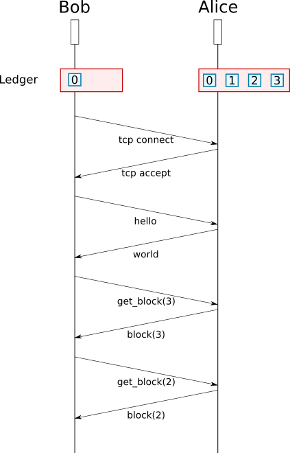

# Architecture

<!-- markdown-toc start - Don't edit this section. Run M-x markdown-toc-refresh-toc -->
**Table of Contents**

- [Communication](#communication)
    - [Message](#message)
        - [Request Reply](#request-reply)
        - [Broadcasted](#broadcasted)
        - [Format](#format)
        - [Pipeline](#pipeline)
    - [Directory](#directory)
    - [Message Sequence](#message-sequence)
        - [Tcp Connection](#tcp-connection)
        - [Hello/World](#helloworld)
        - [Update Ledger](#update-ledger)
- [Crypto](#crypto)
    - [Signature](#signature)
    - [Keys](#keys)
- [Rest](#rest)
- [Wallet](#wallet)
- [Ledger](#ledger)
    - [Update](#update)
    - [Address](#address)
    - [Transaction](#transaction)
    - [Block](#block)
- [PII TL;DR](#pii-tldr)
- [Miners](#miners)
    - [Mining algorithm](#mining-algorithm)
    - [Writting blocks](#writting-blocks)

<!-- markdown-toc end -->

# Communication

## Message

### Request Reply

* Hello/World
* GetPeers/Peers
* GetBlock/Block

### Broadcasted

* Block
* Transaction
* Election Result

### Format

A message can be read in two operations:
* Fixed part containing header size and payload size (each encoded on 32 bits little endian integer).
* Header and payload which are protobuf (v2) messages.

Message definition can be found in messages.proto

Every message is signed with the "communication keys (cf [keys](Keys)).

### Pipeline

## Directory

A bot comes with a configuration containing trusted bots.
* Endpoint.
* Port.
* Public key.

The trusted bots act as:
* Entry point to the network.
* Directory to find other bots.
* Send the tip of the main branch (to avoid long range attacks).

Everytime two bots connect to each others, they exchange credentials and keep them for further use (so every bot act as directory).

## Message Sequence

### Tcp Connection

A bot will try to get to `max_connection` number of connections and accept up to twice that number.
To connect to a remote bot, a bot needs its endpoint (hostname or IP), port and public key. A remote is randomly chosen in the directory.

### Hello/World

The bot establishing the connection is in charge of sending a Hello message.
It contains the public key (of the bot connecting) and a optional listening port.

The remote answers with:
* A list of peers (see [Directory](Directory)).
* If it accepts the connection. Keeping the connection is based on the actual number of connections a bot already has, to avoid getting a [star network](https://en.wikipedia.org/wiki/Star_network).
* The tip of the main branch.

With those really few rules, we are able to achieve a connected, scalable and decentralized mesh network.

Example:
* Bob has a max `max_connection` of 3. He connects to 3 bots.
* If Alice, William and Oli try to connect to Bob, he will accpet them. Now Bob is connected to 6 peers.
* If David tries to connect to Bob, Bob will nicely answer with a ~world~ message containing a peer list, and interrupt the connection.

### Update Ledger

fter ther handshake (hello/world), a bot needs to update its ledger. It uses the tip given by the world message to recursively ask for a parent block.

# Crypto

## Signature

[ECDSA](https://en.wikipedia.org/wiki/Elliptic_Curve_Digital_Signature_Algorithm) (ECP256K1 flavor).

## Keys

Two types of keys are used:
* Communication, each bot auto generates a pair the first time it starts, and stores them on disk (unprotected, and we should do something about it).
* Transaction (some call them Wallet) keys. Those that "hold" your NCC.

Security of keys are a let to the user.

# Rest

The bot exposes a local REST endpoint (http).

It allows to request the ledger, and send transactions to the network.

# Wallet

We provide an Electron application that will handle the signature. Neither the private key nor the password for the wallet file are passed to the bot.

# Ledger

Contains the blockchain. It is stored in a mongo local database (each
bot has its own).  Two collections are used, one containing block
headers, and other one containing transactions.  Blocks have a pointer
to the previous block (it is a chain after all). To handle forks,
blocks are tagged with a path allowing it to know if a block is an
ancestor of an other in O(1).

The ledger is used to:
* Verify if incoming blocks are legit.
* Create transactions, and compute the wallet balance.
* Send blocks to other bots when they need to update their own ledger.

This last point rely on the identity of the serialization (Protobuf <=> Json <=> Bson), since block are reconstructed for db documents.

## Update

When connecting for the first time, or reconnecting after an absence, a bot needs to update its ledger. This is a critical moment for non POW chains as fake are easy to forge/mine.
During the handshake, bots exchange the tip of their main branch. From there, the bot can ask its peers for parents block to update itself.

## Address

Format is strongly inspired from (Bitcoin's address)[https://en.bitcoin.it/wiki/Technical_background_of_version_1_Bitcoin_addresses]. We hash the public key, take the 20 first bytes. Hash them and take the 4 first byte (as a checksum). Concatenate everything and encode it in base 58.

## Transaction

A transaction has:
* An id (the hash of the transaction).
* An array of public keys and signatures.
* 0 or many inputs.
  * Input refer to an unspent output transaction by its hash and output id.
  * Index of the public key and signature.
* 0 or many outputs.
  * Address.
  * Amount.
  * Output id.
  * Optional data.
* Optional fees (for the block miner).
* Optional data.

To write a transaction you first have to set to empty the signatures and id (and fill the remaining fileds).
Sign, set the signatures, hash and set the id.

Transactions without inputs and outputs are for free (no fees) cases (e.g. write data to the blockchain).

## Block

Contains a header:
* Id (hash of the block, done with empty id).
* Timestamp.
* Previous block's hash.
* Public key of author.
* Height.

And a list of transactions. Transaction are sorted by their hash.

# PII TL;DR

The PII is an algorithm rating addresses based on their transactions.

After a period called "assembly", an election is made. Addresses are rated and ranked based on transactions made during this period. The assembly last 12000 blocks.
The 500 first addresses will be allowed to write blocks during the "after the next" (not the following, the one after) assembly. We delay the use of the ranking to smoothen
PII computation and stall the blockchain.

During an assembly, addresses amongs the 500 top are chosen randomly to write a block.

The seed for randomness is the sha3-256 of the parity of the hash of every block of the election assembly.

Example:
* During the election blocks hash are: 0xdead, 0xc0de, 0x4242, 0x1337 => hashing 0001

Since the last miner of the assembly period can "choose" the hash parity by selecting transaction it inserts in the block. The last miner can only choose between two seeds.

# Miners

Miners need to register by writting a "special" transaction into the blockchain. Later, this transaction will be used to separate keys signing blocks from keys earning Pii.

## Mining algorithm

Mining algorithm are not written (yet). Developpers can write their own using the rest API (or by hacking the actual C++ code).

## Writting blocks

In order to write blocks (and to be rewarded), miners will need to share their keys with the bot.
